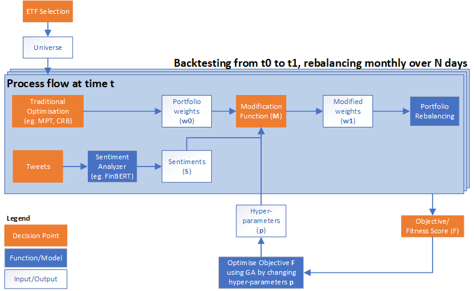
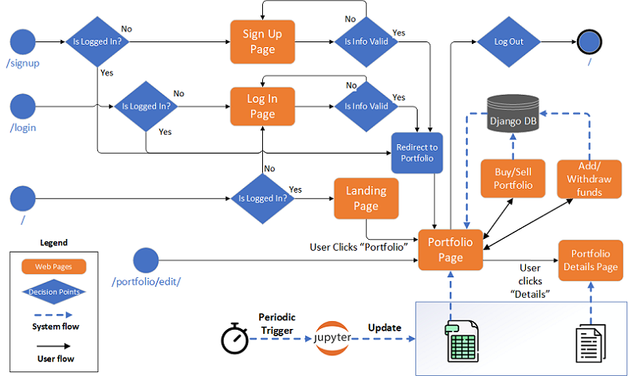
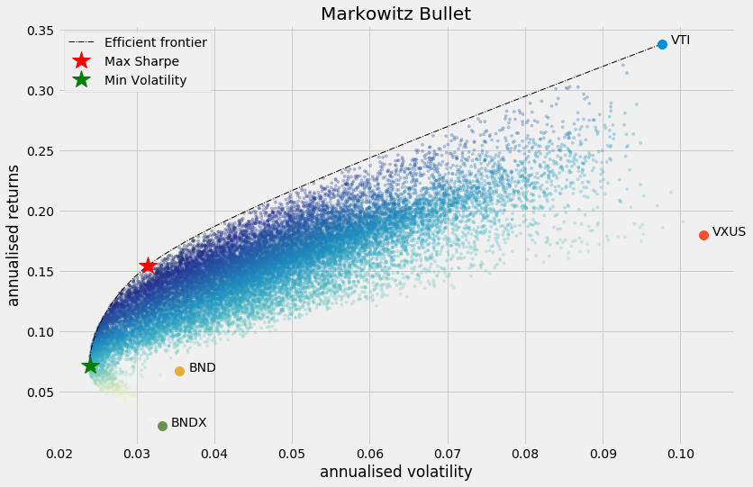

[![Contributors][contributors-shield]][contributors-url]
[![Forks][forks-shield]][forks-url]
[![Stargazers][stars-shield]][stars-url]
[![Issues][issues-shield]][issues-url]
[![MIT License][license-shield]][license-url]
[![LinkedIn][linkedin-shield]][linkedin-url]

<!-- PROJECT LOGO -->
<br />
<p align="center">
  <a href="https://github.com/eleow/roboadvisorSystem">
    
  </a>

  <h3 align="center">Robo-Advisor using BERT sentiments from Twitter feeds for enhanced Portfolio Optimisation with Genetic Algorithm</h3>

  <p align="center">
    Automatic goal-oriented portfolio allocation and rebalancing using a variety of classic and machine learning algorithms, as well as our so-called Sentimental All-Weather (SAW) and Sentimental Modern Portfolio Optimisation (SMPT) portfolios
    <br />
    <br />
    <br />
    <a href="https://smartportfolioadvisor.herokuapp.com/">View Heroku demo</a>
    ·
    <a href="https://github.com/eleow/roboadvisorSystem/issues">Report Bug</a>
    ·
    <a href="https://github.com/eleow/roboadvisorSystem/issues">Request Feature</a>
  </p>
</p>

## About

We propose a hybrid approach to portfolio managemnt, using traditional portfolio optimisation approaches as a baseline and augmenting portfolio performance using sentiments derived from Twitter. The usage of traditional portfolio optimisation as a backbone is advantageous as it is mostly familiar to investors and fund managers alike, and is easier to explain. By using Twitter sentiments as an insight into overall investor sentiments, we will also be pro-active towards potential market dips and spikes, and be able to increase our cumulative returns. An overview of the proposed approach, and the out-of-sample performance are shown below.




An end-to-end robo-advisor system is developed using Django, leveraging [Django Edge v2.2](https://django-edge.readthedocs.io/en/latest/). The list of portfolios is easily configurable from a spreadsheet, and includes SPDR
sector ETFs, and All-Weather ETFs, SAW and SMPT portfolios. The overall user and system flows are shown below. As a prototype robo-advisor, it will only have the following core functionalities:

- Basic user management - sign up and log in,
- Summary page showing current account balance, earnings, portfolio as-
set value, etc,
- Add and withdraw funds (virtual funds, no actual interface with real money), (iv) Portfolio management
- Compare, buy and sell portfolios.



For more details, please refer to the complete paper [here](https://github.com/eleow/roboadvisorSystem/blob/master/docs/Robo_Advisor_using_BERT_sentiments_from_Twitter_feeds_for_enhanced_Portfolio_Optimisation_with_Genetic_Algorithm.pdf).

This repository can also be used to facilitate the experimentation of different portfolio algorithms. Refer to [example Jupyter notebooks](https://github.com/eleow/roboadvisorSystem/blob/master/SystemCode/backend/notebooks)


## Getting Started

### Installation

* Before cloning the repository, make sure you have git-lfs installed on your environment. The instructions to do so can be found [here](https://help.github.com/en/github/managing-large-files/installing-git-large-file-storage)

* If using Windows, install [GNU Make](https://www.gnu.org/software/make/) to utilise make commands in the repo.
* Then clone this repo:

```sh
git clone https://github.com/eleow/roboadvisorSystem.git
```

* For frontend code, install prerequisites in "requirements.txt"
* For backend code, install prerequisites in "\SystemCode\backend\requirements.txt"
* Note: zipline uses pandas==0.22.0 (Ignore warning about conflicts)

## Usage

Robo-advisor system can be started by running the front-end Django server. Start the front-end by typing the following in your Anaconda environment, in the *root directory* of the repo

```bash
make front
```

Alternatively, if 'make' is not installed, then you can type the following

```bash
cd /d SystemCode/frontend/smartportfolioWeb/src
python manage.py runserver
```

## Examples

Example usage of most backend functionalities can be found in the Jupyter Notebooks, [Examples](https://github.com/eleow/roboadvisorSystem/blob/master/SystemCode/backend/notebooks)

### Examples for Sentiment Analysis

Sentiment analysis example is found in the Jupyter Notebook, [Sentiments](https://github.com/eleow/roboadvisorSystem/blob/master/SystemCode/backend/notebooks/Sentiments.ipynb)

Tweets are obtained via ["Twitter-Get-Old-Tweets-Scraper"](https://github.com/eleow/Twitter-Get-Old-Tweets-Scraper) using Jupyter Notebook, [GetTwitterData.ipynb](https://github.com/eleow/roboadvisorSystem/blob/master/SystemCode/backend/notebooks/GetTwitterData.ipynb). Note that after retrieving a certain number of tweets (14000++), Twitter will block the request with "Sorry, die Anzahl deiner Anfragen ist begrenzt" which means "Sorry, the number of your requests is limited". Then just adjust argument "--until" with the earliest date where it failed and rerun the script after waiting for a while or with a different IP address, and save to a new file.

### Examples for Portfolio Optimisation

Portfolio optimisation examples are found in the Jupyter Notebook, [Portfolios](https://github.com/eleow/roboadvisorSystem/blob/master/SystemCode/backend/notebooks/Portfolios.ipynb).

### Plot Markowitz bullet

Plotting the Markowitz bullet is a *simple one-liner* (using default settings) by just providing _prices_, which is a pandas DataFrame containing adjusted closing prices of the asset (each row is a date and each column is a ticker/id)

```python
from utils import generate_markowitz_bullet
generate_markowitz_bullet(prices)

```

This will generate the following:

* Markowitz Efficient Frontier, represented by a dotted line
* Optimum portfolio based on maximum Sharpe ratio (red star)
* Optimum portfolio based on minimum volatility (green star)
* Random portfolios, plotted with color map applied based on Sharpe ratio




## License

Distributed under the [MIT License](LICENSE)

## Acknowledgements

Backtesting is performed using the Pythonic algorithmic trading library, [Zipline](https://www.zipline.io/)

Markowitz optimisation and Hierarchical Risk Parity implementations are provided by [PyPortfolioOpt](https://pyportfolioopt.readthedocs.io/en/latest/)

Genetic Algorithm implementation is provided by [Distributed Evolutionary Algorithms in Python (DEAP)](https://deap.readthedocs.io/en/master/)

Aesthetic style of plotting Markowitz bullet is borrowed from article by [Ricky Kim](https://towardsdatascience.com/efficient-frontier-portfolio-optimisation-in-python-e7844051e7f)

The front-end UI for the robo advisor system is built using the [Django Web Framework](https://www.djangoproject.com/)

<div>Robot icon made by <a href="https://www.flaticon.com/authors/photo3idea-studio" title="photo3idea_studio">photo3idea_studio</a> from <a href="https://www.flaticon.com/" title="Flaticon">www.flaticon.com</a></div>


<!-- MARKDOWN LINKS & IMAGES -->
<!-- https://www.markdownguide.org/basic-syntax/#reference-style-links -->
[contributors-shield]: https://img.shields.io/github/contributors/eleow/roboadvisorSystem
[contributors-url]: https://github.com/eleow/roboadvisorSystem/graphs/contributors
[forks-shield]: https://img.shields.io/github/forks/eleow/roboadvisorSystem
[forks-url]: https://github.com/eleow/roboadvisorSystem/network/members
[stars-shield]: https://img.shields.io/github/stars/eleow/roboadvisorSystem
[stars-url]: https://github.com/eleow/roboadvisorSystem/stargazers
[issues-shield]: https://img.shields.io/github/issues/eleow/roboadvisorSystem
[issues-url]: https://github.com/eleow/roboadvisorSystem/issues
[license-shield]: https://img.shields.io/github/license/eleow/roboadvisorSystem
[license-url]: https://github.com/eleow/roboadvisorSystem/blob/master/LICENSE
[linkedin-shield]: https://img.shields.io/badge/-LinkedIn-black.svg?style=flat-square&logo=linkedin&colorB=555
[linkedin-url]: https://linkedin.com/in/edmundleow
[product-screenshot]: images/screenshot.png

